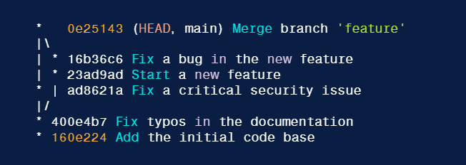

# Git is a version control


### [Git is a version control](#git-is-a-version-control)

#### [Basics command for Git](#basics-command-for-git-1)
* [`git init`](#git-init)
* [`git add`](#git-add)
* [`git status`](#git-status)
* [`git commit`](#git-commit)
* [`git remote`](#git-remote)
* [`git push`](#git-push)
* [`git clone`](#git-clone)
* [`git pull`](#git-pull)
* [`.gitignore`](#gitignore)
* [`git log`](#git-log)
* [`git diff`](#git-diff)
* [`git reset`](#git-reset)

#### [Branching](#branching-1)

* [`git branch`](#git-branch)
* [`git checkout`](#git-checkout)
* [`git switch`](#git-switch)

#### [Merge vs Rebase](#merge-vs-rebase-1)
* [`git merge`](#git-merge)
* [`git rebase`](#git-rebase)

#### [Stashing](#stashing-1)
* [`git stash`](#git-stash)

#### [Squashing](#squashing-1)

#### [Merge conflict resolve](#merge-conflict-resolve-1)

---

## Basics command for Git

#### `git init` 
Initialize Git
```bash
$ git init         # Initiates an empty git repository
```

#### `git add`
Add files to the staging area for commit
```bash
$ git add .  
# Adds all the files in the local repository and stages them for commit

$ git add README.md 
# To add a specific file

$ git add -p README.md
# -p (--patch) : Choose to add part of changes in file to staging area 
```

#### `git status`

Checking stages (Best practice : always checking stages before commit)
```bash
$ git status       # Lists all new or modified files to be committed

$ git status -s    # For shorter output
```

#### `git commit`

Commit changes you made to your Git repo (local)
```bash
$ git commit -m "commit message"
# commit message should describe what you have changed

$ git commit -am "commit message"
# add and commit (use for modified file only can't use on new file)
```

Changing the last commit
```bash
$ git commit --amend
# This will prompted the editer for you to modify the most recent commit
# It can also be used to simply edit the previous commit message

$ git commit --amend -m "an updated commit message"
# -m : allows you to pass in a new message from the command line without being prompted to open an editor

# NOTE: Don’t amend public commits!
```

#### `git remote`

Add a remote to your Github Repo
```bash
$ git remote add origin <remote_repository_URL>
# sets the new remote as origin
```

List the remote connection you have to other repository
```bash
$ git remote -v    
# lists the URLs of the remote connections you have to other repositories
```

#### `git push`

Pushes the changes in your local repository to the remote repository (Github)
```bash
$ git push -u origin master 
# pushes changes to origin
# -u (--set-upstream) : make you git push default behavior to push changes to origin/main
```

#### `git clone`

Cloning a Git Repo
```bash
$ git clone <remote_repository_URL>
```

#### `git pull`

Pulling changes from remote repository to your local repository
```bash
$ git pull origin main

# But if you have upstream you can use
$ git pull

# git pull is combination of git fetch and git merge (git fetch followed by git merge)
```

#### `.gitignore`

Ignore files/folders
```bash
$ touch .gitignore
$ echo "file/folder name" > .gitignore
# git will ignore all file or folder in .gitignore
```

#### `git log`

View commit history
```bash
$ git log          # Showing commit history (default format)

# flags
# --all : showing all commit (default is show all commit in the history of branches, tags and other refs but it does not show commits that are not reachable from any ref)
# --oneline : condenses each commit to a single line
# --decorate : display all of the references (e.g., branches, tags, etc) that point to each commit.
# --graph : draws an ASCII graph representing the branch structure of the commit history
```


```bash
$ git log --oneline 
```


```bash
$ git log --oneline --decorate 
```


```bash
$ git log --graph --oneline --decorate
```


#### `git diff`

Show changes between working directory/commit
```bash
$ git diff        # show unstaged changes between your working directory

$ git diff <file name>
# show unstaged changes between specific file 

$ git diff <commit hash>
# show changes between specific commit and your current working directory
```

#### `git reset`

Uncommit Changes you just made to your Git Repo
```bash
$ git reset HEAD~1
# HEAD is pointer to your current commit (in this case latest commit)
# HEAD~1 go back 1 commit further from HEAD
# Remove the most recent commit
# And you need to commit again!

$ git reset <commit hash>
# Remove commit to your certain commit 
```

Undo Changes you just made to your Git Repo
```bash
$ git reset --hard <commit hash>
# Remove commit and all change to your certain commit
```

## Branching

#### `git branch`
List all branches
```bash
$ git branch

$ git branch -a    
# -a (--all) : list all branch including remote branch 
```

#### `git checkout`

Create branch
```bash
$ git branch <bracnh name>

# OR create and move to that branch
$ git checkout -b <branch name>
```

Delete branch
```bash
$ git branch -d <branch name>
```

#### `git switch`

Switching between branch
```bash
$ git checkout <branch name>
# or
$ git switch <branch name>
# switch to specific branch

$ git checkout -
# switch to previous branch
```

Switching to specific version
```bash
$ git checkout <commit hash>
# switch to specific commit (your working directory also change to that commit)

# But if your change and commit, this will create unnamed branch from this version. To prevent this we will use
$ git checkout <commit hash> <file/folder to switch>

# ex. git checkout a1e8fb5 .
# this will switch all file in working directory to version that commit hash is a1e8fb5 and if you have change and commit, this will continue your commit in your branch 
```

## Merge vs Rebase


Used for same purpose (intergrating commits)  
`Merge` : messy project history (ton of merge commits) but commits history still the same  
`Rebase` : cleaner project history (linear project history) but rewritten commits history (different commit hash)

<mark>**WARNING**</mark> : Never rebase commits that have been shared with others. if you already pushed commits up to Github <mark>DO NOT</mark> rebase them unless you are positive no one on the team is using those commits!

#### `git merge`

Merging branch
```bash
$ git merge <branch name>
# Merge specific branch into the current branch

# usually we don't merge into main branch on local repository we will merge main branch on remote repository
# we use this only if main branch on remote repository is update and we want our feature branch that we dev to also update with main branch
# ex. on feature branch
#  	 git merge main
# to update our feature branch up to date with main branch
```

#### `git rebase`

Rebasing branch
```bash
$ git rebase <branch name>
# apply any commits of current branch base on specific branch (merge but base on specific branch and make new commit history for current branch)
```

Interactive Rebase
```bash
$ git rebase -i HEAD~6
# -i (--interactive) : enter the interactive rebase mode, which allows us to squash commits, reword commit messages, add files, drop commits and more

# Note that we need to specify how far back we want to rewrite commits. You can also provide a commit hash.

# HEAD~6 : last 6 commits
```

it will open a list of commits alongside a list of commands that we can choose from.


commonly used commands:
- pick - use the commit
- reword - use the commit, but edit the commit message
- edit - use commit, but stop for amending
- squash - meld into previous commit
- drop - remove commit

## Stashing
stashing uncommited changes so that we can return to them later, without having to make unnecessary commits   

#### `git stash`

git stash is super useful command that helps you save changes that you are not yet ready to commit. You can stash changes and then come back to them later
```bash
$ git stash

# You can also use
$ git stash save

# Running this will take all uncommitted changes (staged and unstage) and stash them, reverting the changes in your working copy.

# You can also stashing multiple times it will add multiple stashes onto stack of stashes. They will all be stashed in the order you added them
```

You can also stashing with stash message
```bash
$ git stash push -m "stash message"

# or
$ git stash save "stash message"
```

Include untracked files in stash (files that you have never checked in to Git)
```bash
$ git stash -u
# Normally, untracked files will not be included in the stash
# -u : to include those untracked files
```

Use git stash pop to remove the most recently stashed changes in your stash and re-apply them to your working copy (get you changes back!)
```bash
$ git stash pop
# get your stashed changes back to your working copy
```

Apply whatever is stashed away, without removing it from the stash
```bash
$ git stash apply
# This can be useful if you want to apply stashed changes to multiple branches
```

Viewing stashes
```bash
$ git stash list
# view all stashes
```

Applying specific stashes
```bash
$ git stash apply <stash id>

# apply a particular stash
# ex.
# git stash apply stash@{2}
# you can see your stash refs with git stash list
```

Dropping stashes
```bash
$ git stash drop <stash id>

# to delete a particular stash
# ex.
# git stash drop stash@{2}
```

Clearing the stash
```bash
$ git stash clear
# clear out all stashes
```
Usually, when we working with stash we only use git stash and git stash pop (normal use)

### Squashing
Combining multiple commits into one (keep git history tidier and easier to read)

Using interactive rebase (have fully control)
```bash
$ git rebase -i HEAD~6
# use interactive rebase to edit last 6 commits
# and then change pick command to squash (reserved one pick command that we want other commits to squash to that commit)
# save and quit the editor
```


Squashing on merge
```bash
$ git merge --squash <branch name>

# ex. git merge --squash feat
# we can squash all commits from a feature branch together when merging
# --squash : take all changes from the feature branch and apply them back to the current branch

# then we need to generate a new commit
$ git commit -m "commit message"
```

### Merge conflict resolve
Undo merging or rebasing
```bash
$ git merge --abort      # undo merging

$ git rebase --abort     # undo rebasing
```

Resovle manually  
- using your text editor and change file content to your preference (also delete conflict marker on your file) then save and commit
- use GUI tool to help resolve conflict efficiently such as mergetool

```bash
$ vim <conflict file>    
# using your favourite text editor to manually resolve merge conflict

$ git mergetool          # using mergetool (GUI tool)
```
##### ***<div align="right">BXDMAN & REDAXN | ISAG</div>***


